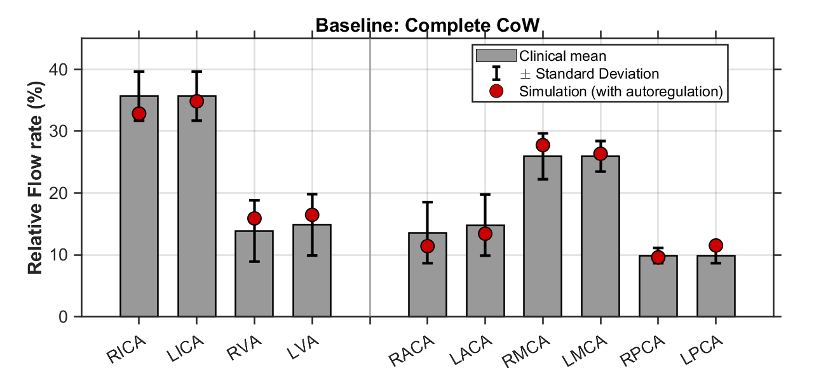
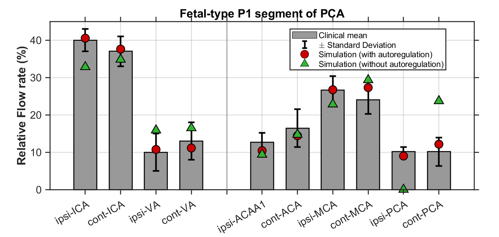
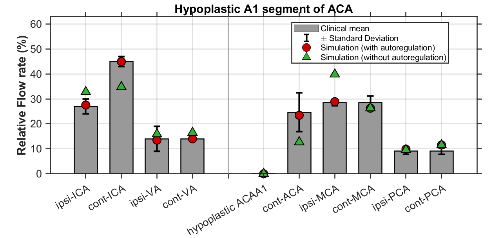

# WithCAM: Multiscale Cerebral Blood Flow Solver

MATLAB implementation of the CAM-incorporated 0D-1D coupled solver described in the manuscript:<br>
**"Multiscale modeling of blood circulation with cerebral autoregulation and network pathway analysis for hemodynamic redistribution in the vascular network with anatomical variations and stenosis conditions"**

## Quick Start

```matlab
cd Multiscale_CAM_Code
main_WithCAM_coupled_solver   % one-click: runs all 3 conditions + generates figures
```

Or batch mode: `./run_all.sh`

## What It Does

Running `main_WithCAM_coupled_solver.m` performs:

1. **0D-1D coupled simulation with CAM** for three CoW configurations:
   - Condition 1: Baseline (complete CoW)
   - Condition 2: PCA (Fetal-type posterior cerebral artery, P1 segment absent)
   - Condition 3: ACA (Missing anterior cerebral artery A1 segment)

2. **Comparison figure generation**: three bar charts comparing model results against clinical statistics (with/without CAM vs [mean ± s.d.] from Zarrinkoob et al. (2015) )
<p align="center">
  
  
  
</p>

## Requirements

- MATLAB R2018b or newer versions (base MATLAB only; no additional toolboxes required) 
- No external data files beyond the three `.mat` input files included

## Supplementary Videos
### S1. Dynamical flow propagation across the cerebral vascular network
Dynamical flow propagation across the cerebral vascular network. Time-dependent cerebral arterial perfusion under the three conditions are illustrated.
1. **Baseline**
<p align="center">
  
</p>

2. **PCA**
<p align="center">
  
</p>

3. **ACA**
<p align="center">
  
</p>

---

### S2. Cerebral and Arterial Systems

Coupled whole-body arterial system and image-based cerebral circulation network.  
Time-dependent inlet flow conditions and cerebral arterial perfusion are illustrated.

<p align="center">
  
</p>

---

### S3. Cerebral Circulation With and Without Stenosis

Comparison of cerebral hemodynamics under normal and stenotic conditions, highlighting bifurcation–confluence transitions and collateral pathway recruitment.

<p align="center">
  
</p>
